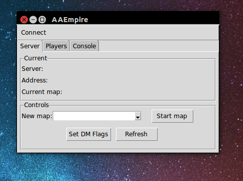
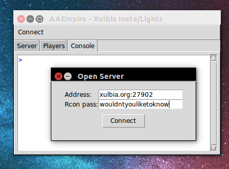
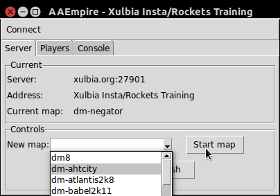
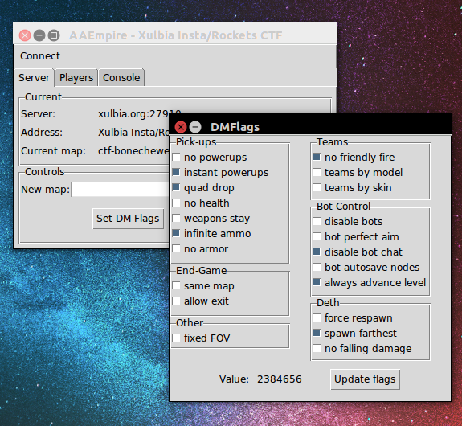
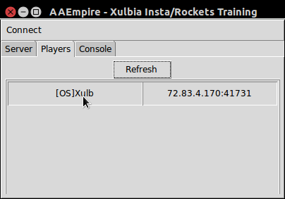
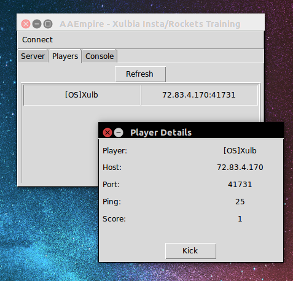
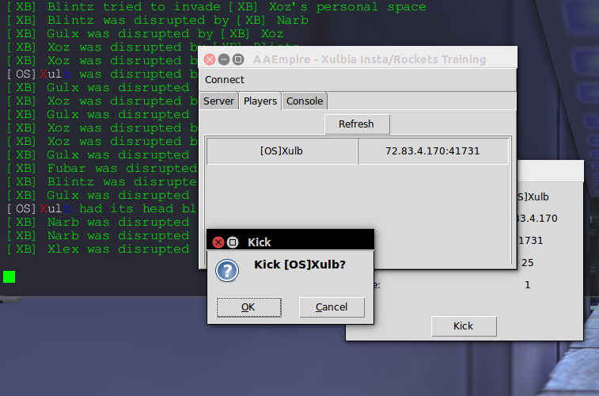
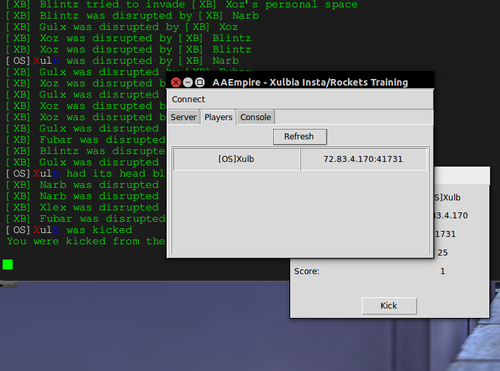
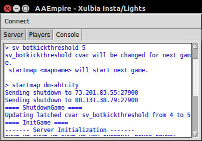

aaserver
========
Tools for communicating with an [Alien Arena](http://red.planetarena.org) server.

Includes AAEmpire, a little GUI to manage your running servers.

# aaempire

## Installation

You will need Python 3.4.

* [WinDoze](https://www.python.org/downloads/windows/)
* 'Nix: use your fave package manager: e.g. for Ubuntu, do
```
$ sudo apt-get install python3.4
```

Download the distribution:

* [WinDoze .zip](dist/aaempire-0.1.zip)
* ['Nix .tar.gz](dist/aaempire-0.1.tar.gz)

Expand and install:

```
In a cmd window:
C:> [unzip command] aaempire-0.1.zip
C:> cd aaempire
C:> python setup.py install
```

```
$ tar -xzf aaempire-0.1.tar.gz
$ cd aaempire
$ python3 setup.py install
```

Run:

```
c:> aaempire
or if that doesn't work
c:> python \Python3.4\Scripts\aaempire
```

```
$ aaempire
```

## Walkthrough



Connect to a server using the *Connect* menu. Multiple servers can be entered and saved for future sessions.



The *Server* tab provides some overall information and allows you to quickly start maps from a pulldown:



Or calculate -- and set -- DM flags:



The *Players* tab shows who's currently playing. Click the name to get further details:




Kick with a click:

 

Finally, the *Console* tab is a direct rcon console to your server; use it like a command line.



GLHF-
Xulb
